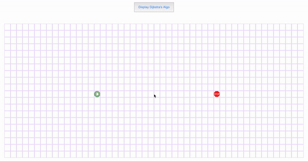

This is a visualization tool that illustrates the working of the pathfinding algorithms to render the shortest path between two nodes.
Front-end is developed using React, Css, HTML. 
Created a start node, end node, obstacle nodes and a grid.
Generated animations to visualize the exploration made by the algorithm. The tool currently works for Dijktra's algorithm. Fututre work involves adding BFS, DFS, Greedy, and sorting algorithms with interactive UI.

Demo

